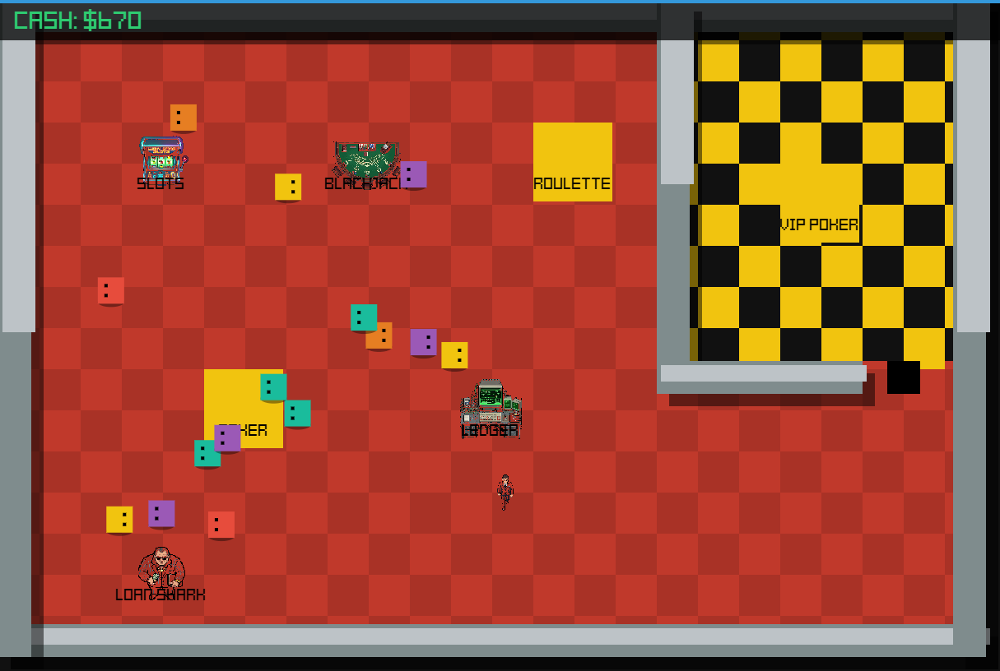
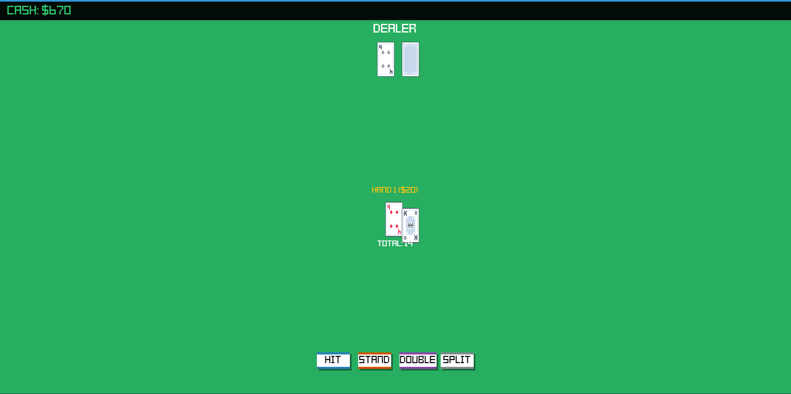
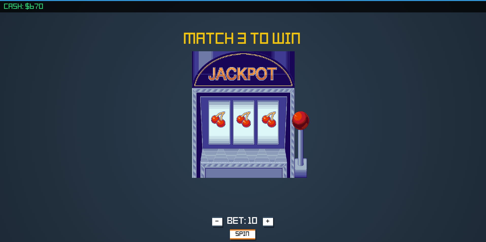
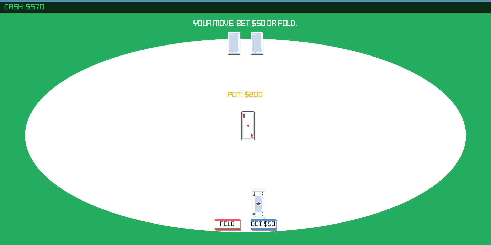
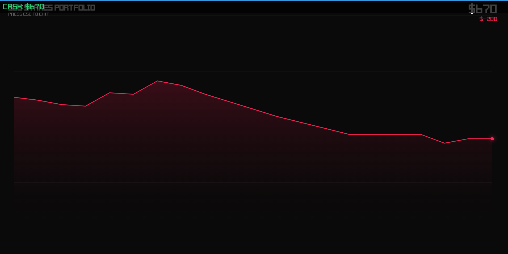

# Sus Stakes

i love casino games so i built my own from scratch. walk around a 2d casino lobby, play 5 different minigames, and try not to go broke. everything saves to your browser. no frameworks, just vanilla js and canvas.

built for **#horizons**

**play it here:** https://fbiopeningupp.github.io/Sus-Stakes/

> walk up to the BLACKJACK cabinet and press E to jump straight into a game!

## screenshots

## how to play

- **WASD** to move around the lobby
- **E** to interact with a game cabinet
- **ESC** to leave any minigame and go back to the lobby
- **R** to wipe your save (hard reset)
- earn **$25,000** to unlock the VIP room
- if you go broke, find the **Loan Shark** in the bottom left corner for a $1k bailout

## games

| game | what it does |
|------|-------------|
| blackjack | full blackjack with hit, stand, split, and double down. press C to toggle a hidden card counting trainer that tracks the hi-lo running count |
| roulette | this one has actual physics. the wheel and ball both have their own velocity and friction, the ball visually orbits and drops into a pocket based on real math, not just a random number |
| slots | pull the lever and match symbols for payouts |
| poker | texas hold'em against the house |
| ledger | a terminal that draws a live stock-market style graph of your bankroll history over time. goes green when you're up, red when you're down |

## how it works

- custom scene manager runs a 60fps game loop and handles switching between the lobby and all minigames
- AABB collision engine predicts player movement and blocks it if you'd clip into a wall or cabinet
- roulette uses real angular velocity and friction, ball orbits using trig and drops into a pocket based on actual physics
- blackjack supports splitting up to 4 hands, doubling down, and has a hidden card counting trainer that tracks hi-lo running count and true count
- the ledger reconstructs your full bankroll history from saved transactions and draws a dynamic line graph that auto-scales
- vip room is blocked by a coordinate-based forcefield that checks your bankroll in real time
- all sounds are synthesized using web audio api oscillators with frequency ramps, no audio files
- 15 NPCs wander the lobby with their own randomized movement AI
- bankroll and transaction history persist to localStorage across sessions

## built with

- vanilla javascript (es6 modules, no frameworks)
- html5 canvas api
- web audio api
- localStorage

## ai usage

used ai to help write rendering code and debug physics issues. all game design, features, and testing were done by me.